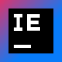

<h1 align="center">Hi👋! I'm Piotr</h1>
<h3 align="center">Motivated Junior Full-Stack Developer💻</h3>

###

  
  

###

- 🔭 I’m currently working on 🔍[WayFinder](https://github.com/vilible/way_finder)
- 🌱 I’m currently learning [Flutter](https://flutter.dev)
- 📫 How to reach me: <stefanskip@proton.me>

###

  <h3>Languages</h3>
  
  
  
  
  
  
  
  
  
  
  
  
  
  
  
  
  

###

  <h3>Frameworks</h3>
  
  
  
  
  

###

  <h3>Tools</h3>
  
  
  
  
  
  
  
  
  

###
